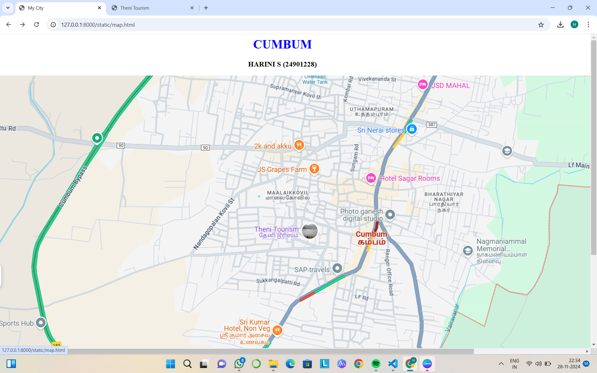
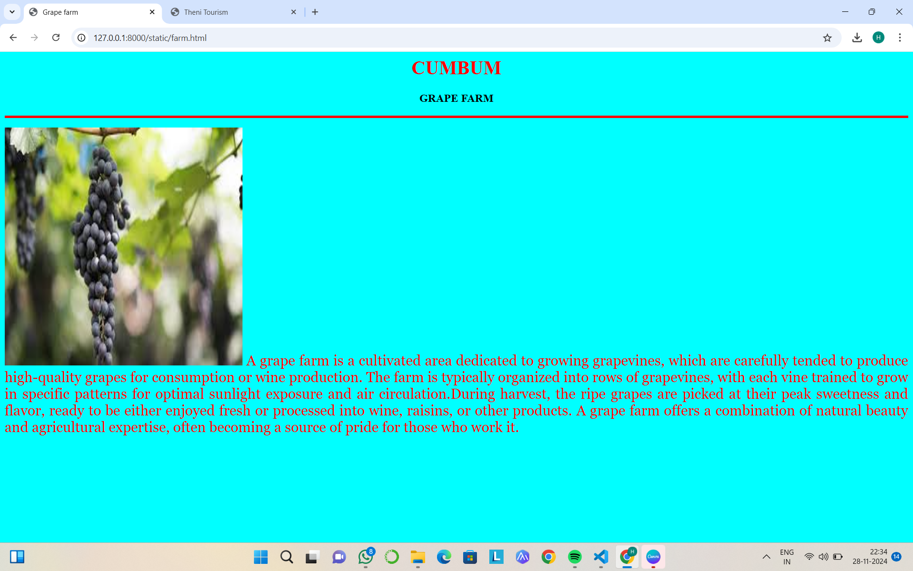
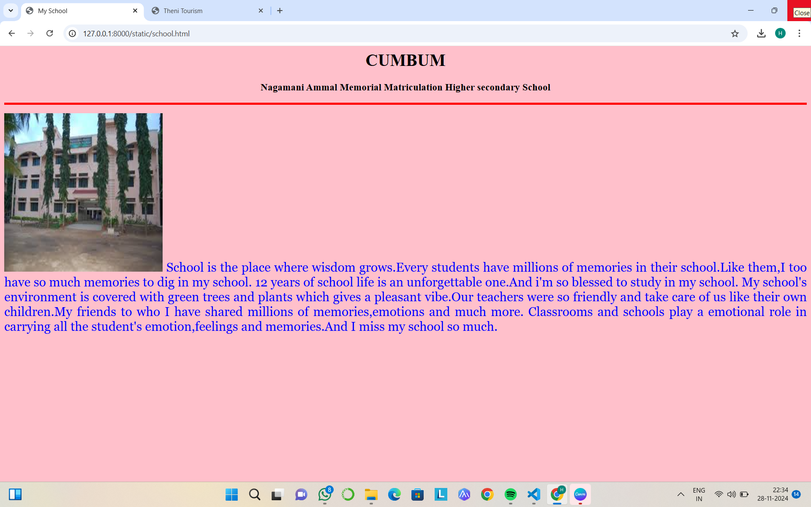
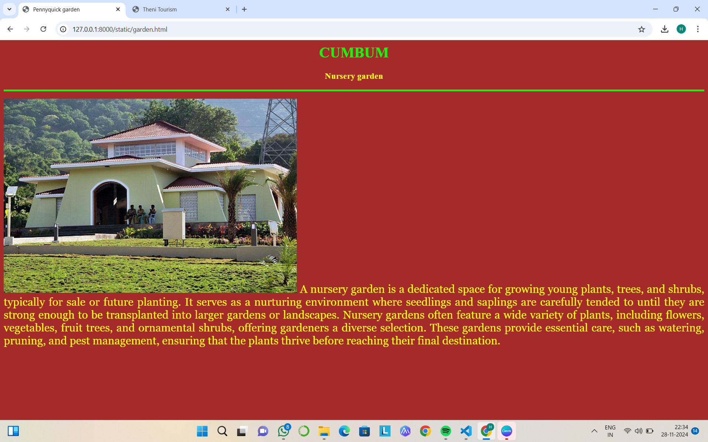
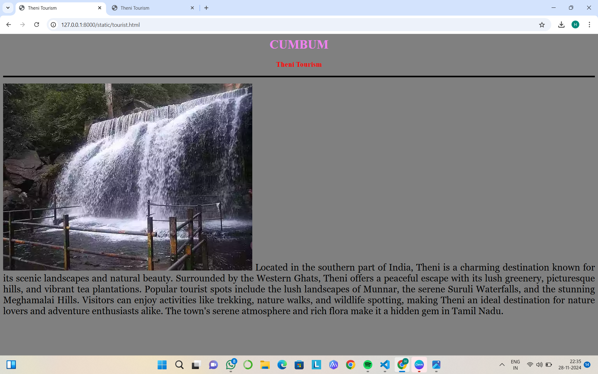

# Ex04 Places Around Me
## Date: 

## AIM
To develop a website to display details about the places around my house.

## DESIGN STEPS

### STEP 1
Create a Django admin interface.

### STEP 2
Download your city map from Google.

### STEP 3
Using ```<map>``` tag name the map.

### STEP 4
Create clickable regions in the image using ```<area>``` tag.

### STEP 5
Write HTML programs for all the regions identified.

### STEP 6
Execute the programs and publish them.

## CODE
```
map.html
<html>
    <head>
        <title>My City</title>
    </head>
    <body>
        <h1 align="center">
            <font color="Blue"><b>CUMBUM</b></font>
        </h1>
        <h3 align ="center">
            <font color="BLACK"><b>HARINI S (24901228)</font>
        </h3>
        <center>
            

<map name="image-map">
    <area target="" alt="myschool" title="myschool" href="school.html" coords="1200,413,1387,498" shape="rect">
    <area target="" alt="pennycuick garden" title="pennycuick garden" href="garden.html" coords="1067,933,1278,989" shape="rect">
    <area target="" alt="theni tourism" title="theni tourism" href="tourist.html" coords="668,384,848,432" shape="rect">
    <area target="" alt="js grapes farm" title="js grapes farm" href="farm.html" coords="677,228,845,268" shape="rect">
    <area target="" alt="my home town" title="my home town" href="" coords="11,17,1894,988" shape="rect">
</map>
            
                
            
        </center>
    </body>
</html>

farm.html
<html>
    <head>
        <title>Grape farm</title>
    </head>
    <body bgcolor="cyan">
        <h1 align="Center">
            <font color="Red"><b>CUMBUM</b></font>
        </h1>
        <h3 align="center">
            <font color="Black"><b>GRAPE FARM</b></font>
        </h3>
        <hr size="4" color="Red">
        <p align="justify">
            <font face="Georgia" size="5" color="red">
                
                A grape farm is a cultivated area dedicated to growing grapevines, which are carefully tended 
                to produce high-quality grapes for consumption or wine production. The farm is typically organized 
                into rows of grapevines, with each vine trained to grow in specific patterns for optimal sunlight 
                exposure and air circulation.During harvest, the ripe grapes are picked at their peak sweetness 
                and flavor, ready to be either enjoyed fresh or processed into wine, raisins, or other products. 
                A grape farm offers a combination of natural beauty and agricultural expertise, often becoming a 
                source of pride for those who work it.
            </font>
        </p>
    </body>
</html>

tourist.html
<html>
    <head>
        <title>Theni Tourism</title>
    </head>
    <body bgcolor="grey">
        <h1 align="center">
            <font color="violet"><b>CUMBUM</b></font>
        </h1>
        <h3 align="center">
            <font color="red"><b>Theni Tourism</b></font>
        </h3>
        <hr size="4" color="black">
        <p align="justify">
            <font face="Georgia" size="5">
                
            Located in the southern part of India, Theni is a charming destination known for its scenic landscapes 
            and natural beauty. Surrounded by the Western Ghats, Theni offers a peaceful escape with its lush greenery, 
            picturesque hills, and vibrant tea plantations. Popular tourist spots include the lush landscapes of Munnar, 
            the serene Suruli Waterfalls, and the stunning Meghamalai Hills. Visitors can enjoy activities like trekking, 
            nature walks, and wildlife spotting, making Theni an ideal destination for nature lovers and adventure enthusiasts 
            alike. The town's serene atmosphere and rich flora make it a hidden gem in Tamil Nadu.


            </font>
        </p>

    </body>
</html>

school.html
<html>
    <head>
        <title>My School</title>
    </head>
    <body bgcolor="pink">
        <h1 align="center">
            <font color="black"><b>CUMBUM</b></font>
        </h1>
        <h3 align="center">
            <font color="black"><b>Nagamani Ammal Memorial Matriculation Higher secondary School</b></font>
        </h3>
        <hr size="4" color="Red">
        <p align="justify">
            <font face="Georgia" size="5" color="Blue">
                
                School is the place where wisdom grows.Every students have millions of memories in their school.Like them,I too have so
                much memories to dig in my school. 12 years of school life is an unforgettable one.And i'm so blessed to study in my school.
                My school's environment is covered with green trees and plants which gives a pleasant vibe.Our teachers were so friendly
                and take care of us like their own children.My friends to who I have shared millions of memories,emotions and much more.
                Classrooms and schools play a emotional role in carrying all the student's emotion,feelings and memories.And I miss my school 
                so much.
            </font>
        </p>
    </body>
</html>

garden.html
<html>
    <head>
        <title>Pennyquick garden</title>
    </head>
    <body bgcolor="brown">
        <h1 align="center">
            <font color="lime"><b>CUMBUM</b></font>
        </h1>
        <h3 align="center">
            <font color="yellow"><b>Nursery garden</b></font>
        </h3>
        <hr size="4" color="lime">
        <p align ="justify">
            <font face="georgia" size="5" color="yellow">
                
                A nursery garden is a dedicated space for growing young plants, trees, and shrubs, typically for sale
                 or future planting. It serves as a nurturing environment where seedlings and saplings are carefully 
                 tended to until they are strong enough to be transplanted into larger gardens or landscapes. 
                 Nursery gardens often feature a wide variety of plants, including flowers, vegetables, fruit trees, 
                 and ornamental shrubs, offering gardeners a diverse selection. These gardens provide essential care, 
                 such as watering, pruning, and pest management, ensuring that the plants thrive before reaching their 
                 final destination.


            </font>
        </p>


    </body>
</html>
```
## OUTPUT







## RESULT
The program for implementing image maps using HTML is executed successfully.
